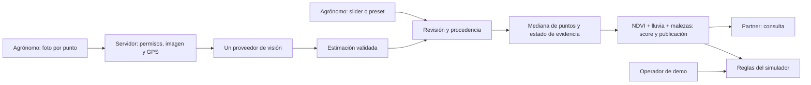

# PreCrop — análisis y diseño para Claude

Estado: base documental del 11-sep-2026. No hay código de aplicación. Requisitos confirmados y propuestas se distinguen abajo.

**Trabajo actual autorizado:** preparar la prueba pública de fotos descrita en [VISION-IA.md](VISION-IA.md), con referencias y comprobaciones locales. El análisis recibe foto + cultivo esperado para distintos cultivos; la primera prueba usa soja. No incluye aún API, pantallas ni elección de proveedor. El conjunto está en [data/vision-growingsoy/EVALUACION.md](data/vision-growingsoy/EVALUACION.md); su preparación no acredita precisión agronómica.

## UPDATE Builder 11-sep — confirmado

> Sumar VISIÓN IA al MVP. Agrónomo sube foto → modelo (gpt-4o-mini / Gemini Flash) → % malezas → score. Partner solo lectura. Fallback slider/presets. Texto completo en pack local: VISION-IA.md + PRECROP-LEER-ESTO.md (Notion sin bloques libres).

Este pack se mantiene local; no requiere cambios en Notion. El usuario confirmó que esos dos archivos no existían: esta es una **base nueva**, creada con el material disponible y las ampliaciones de esta sesión.

Ampliación confirmada del 11-sep:

- Puntos: 3–5 pins dentro del polígono, centro + extremos; tolerancia GPS 30 m. La grilla agro de aproximadamente 30 × 30 m mencionada por el equipo es contexto para después del hack, no un requisito de generar una grilla completa. V2: sesgar muestreo hacia NDVI bajo/alto.
- Fotos: nadir, altura 0,6–1,5 m, horario 10–15 h, EXIF GPS. Sin drone.
- Visión por API existente → % malezas por punto → mediana; sin CNN propia en 36 h.
- Presets P1–P5 bueno/malo en [data/photo-point-presets.json](data/photo-point-presets.json).
- Satélite sigue: pesos NDVI/lluvia/malezas = 0,6/0,25/0,15. Sin fotos no hay verde pleno para el segundo desembolso.

## 1. Problema y resultado esperado

PreCrop reúne evidencia de un lote y presenta un score de condición del cultivo de 0 a 100, un semáforo y un cupo de anticipo simulado. El cliente previsto es una cooperativa, banco o fintech que ya presta; el productor no es el comprador definido en el material base.

Visión IA agrega evidencia de campo aportada por un agrónomo: fotos en 3–5 puntos generan estimaciones de malezas, cuya mediana entra al cálculo del score junto a NDVI y lluvia. El partner consulta qué cambió, cuándo y con qué evidencia. La aplicación financiera del hack demuestra las consecuencias de reglas explícitas con fondos de prueba.

El score no estima solvencia ni garantiza cobros. Una foto aporta una muestra visible; no prueba por sí sola la cobertura de todo el lote. Las afirmaciones comerciales del documento histórico son antecedentes del equipo, no una investigación de mercado nueva.

## 2. Alcance vigente

| Dentro del MVP | Fuera del MVP |
| --- | --- |
| Un lote y una campaña de demo; mapa y evidencia precargada | Multi-lote y operación financiera real |
| Agrónomo sube fotos en 3–5 pins; API estima malezas por punto y se agrega la mediana | CNN propia, grilla completa, drone y selección por NDVI (v2) |
| Score explicado, semáforo y cupo simulado | Diagnóstico agronómico certificado o score crediticio |
| Partner solo lectura | Partner que edita evidencia, score o ejecuta operaciones |
| Fallback con slider/presets etiquetados | Disfrazar datos manuales/simulados como resultados de IA |
| Aporte → desembolso → actualización → rechazo en rojo → repago y saldo no usado | Custodia, precio de mercado del token y dinero real |
| Demo funcional en mock; testnet opcional | Dependencia de Sentinel live o de un faucet el día de la demo |

La exclusión histórica “CV real” queda reemplazada por la inclusión de inferencia sobre fotos con un modelo existente. No amplía el alcance a construir un sistema propio de visión.

## 3. Actores y permisos

| Acción | Agrónomo | Partner | Operador de demo |
| --- | --- | --- | --- |
| Consultar evaluación publicada y evidencia del lote asignado | Sí | Sí | Sí |
| Subir foto, pedir análisis y usar fallback | Sí | No | No por defecto |
| Revisar y publicar evaluación | Sí, propuesta de diseño | No | No por defecto |
| Aporte/desembolso/repago simulado | No | No | Sí |

El operador de demo conserva la historia financiera existente sin convertir al partner en editor. Es una separación de funciones propuesta; no exige un producto de administración adicional. Los inversores/deudor de la historia son personajes simulados, no nuevos módulos del MVP.

Propuesta: identificar usuario y rol mediante una sesión verificada en servidor y autorizar también el acceso al lote. Un selector visual de rol solo sirve para una demo local etiquetada; no constituye autenticación. El cliente no puede elevar permisos enviando `role=agronomo`.

## 4. Recorrido y pantallas

1. **Detalle del lote:** nombre, campaña, mapa con 3–5 pins, score/semáforo, estado de evidencia fotográfica, cupo y fuentes. Mostrar texto e icono además del color. Separar fecha observada de fecha de publicación.
2. **Panel del agrónomo:** seleccionar punto, cargar foto, ver instrucciones de captura, distancia GPS y estado de cada punto. Contexto mínimo: lote/campaña, cultivo y fecha. Ver detalle en [VISION-IA.md](VISION-IA.md).
3. **Revisión propuesta:** mostrar fotos, % por punto, mediana, cobertura de puntos válidos/planificados y efecto sobre el score antes de publicar. El agrónomo puede aceptar la estimación o registrar una corrección manual, preservando ambas procedencias.
4. **Vista partner:** solo la evaluación publicada, foto/evidencia, explicación del score y estado del anticipo simulado. Sin carga, sliders ni acciones financieras.
5. **Consola de demo:** el operador ejecuta aportes, primer desembolso, intento de segundo desembolso y liquidación. Cada operación explica su resultado y conserva el cartel MOCK/testnet.

Estados mínimos de evaluación: sin datos, borrador, analizando, pendiente de revisión, publicada y error. Error de análisis no destruye una evaluación publicada. Una evaluación anterior puede verse con su fecha, pero no habilita nuevos desembolsos si perdió vigencia.

El flujo financiero debe poder demostrarse con presets simulados: una respuesta real del modelo no tiene por qué producir el score exacto que necesita el guion.

## 5. Diseño técnico mínimo propuesto

Reutilizar el stack sugerido en la base: una aplicación Next.js con mapa Leaflet, handlers de servidor para visión/publicación y funciones de dominio compartidas. Elegir versiones y dependencias al comenzar la construcción, comprobando primero si existe código nuevo. No crear todavía carpetas ni instalar paquetes.



| Operación lógica; no fija aún una API | Responsabilidad |
| --- | --- |
| Consultar lote/evaluación | Permisos de lectura y última publicación con sus fuentes |
| Analizar foto | Solo agrónomo; validar imagen, punto y GPS, llamar al proveedor y validar respuesta; no mover fondos |
| Publicar evaluación | Solo agrónomo; validar puntos y procedencia, obtener mediana, recalcular score/cupo y guardar una revisión coherente |
| Ejecutar operación demo | Solo operador; evaluar estado vigente, evidencia fotográfica, saldo, cupo y semáforo en el momento de la operación |

Una única función calcula score/cupo para IA, slider y presets; no tres fórmulas. Una única regla compartida evalúa desembolsos. El simulador debe descontar saldo y registrar la operación conjuntamente, sin doble ejecución por clic repetido. No confiar en score, cupo ni permisos enviados por el navegador.

Persistencia propuesta: guardar evidencia y revisiones publicadas en servidor; el partner lee la misma revisión que publicó el agrónomo. Seleccionar el almacenamiento mínimo compatible con el despliegue cuando este se defina; estado solo en memoria no prueba sincronización entre usuarios ni sobrevive a reinicios. Foto privada, identificador interno y acceso autorizado; no publicar imágenes ni secretos en Git o chain.

### Datos mínimos

| Registro | Contenido |
| --- | --- |
| Lote/campaña | ID, nombre, cultivo, geometría, base de cosecha simulada, haircut |
| Punto de muestreo | ID P1–P5, lote/campaña, posición planificada dentro del polígono y estado |
| Evidencia por punto | ID, punto, autor, captura declarada/EXIF, recepción, GPS EXIF, distancia al pin, controles de protocolo, referencia privada de foto o preset, fuente |
| Estimación de visión | Estado, % o null, motivo/limitaciones, proveedor/modelo y versión del prompt |
| Evaluación publicada | ID/revisión, evidencias por punto, conteos válidos/planificados, mediana, estado de fotos, entradas NDVI/lluvia y fuentes/fechas, score, versión de fórmula, cupo, publicación y vigencia |
| Operación simulada | ID, tipo, importe, participante simulado, evaluación utilizada, resultado y saldo resultante |

No sobrescribir la estimación IA cuando el agrónomo la corrige; registrar el valor manual usado y su autor. La vigencia se evalúa por las fechas de las evidencias, no se rejuvenece una foto vieja al publicarla hoy.

## 6. Reglas de cálculo y dinero de prueba

Confirmado en la base:

```text
cupo = base_valuation_usd × (score / 100) × haircut
haircut demo = 0.7
verde: score >= 70
amarillo: 50 <= score < 70
rojo: score < 50
interés = capital efectivamente desembolsado × 0.10
```

- Verde: nuevo importe positivo dentro del cupo restante y fondos disponibles.
- Amarillo: además aplica un límite adicional fijado al inicio. Su valor y si limita cada operación o el acumulado todavía no están definidos; no inventarlos como regla cerrada.
- Rojo: rechazar todo nuevo desembolso, aunque quede margen teórico de cupo.
- Sin datos vigentes: dejar el desembolso pendiente de actualización.
- Sin fotos: nunca presentar verde pleno para el segundo desembolso, aunque el score numérico sea ≥ 70. Propuesta operativa conservadora: segundo y posteriores desembolsos pendientes hasta completar evidencia fotográfica válida. Mostrar por separado score y habilitación; no inventar un score de 69 para ocultar la falta. Falta confirmar si el equipo prefiere una vía amarilla limitada. Un preset sin foto no levanta esta restricción.
- Cupo restante no negativo: `max(0, cupo - capital desembolsado acumulado)` para esta campaña demo sin crédito revolvente. Una caída no recupera dinero ya prestado ni elimina deuda.
- Repago completo del ejemplo: aportado 50.000, desembolsado 30.000, no usado 20.000, repago 33.000; total a distribuir 53.000 según participación. No generar interés sobre los 20.000 no prestados.

**Pesos confirmados; normalizaciones pendientes.** Con todos los componentes normalizados a 0–100:

```text
weeds_pct = mediana(porcentajes de puntos incluidos)
score = 0.60 × componente_ndvi + 0.25 × componente_lluvia + 0.15 × componente_malezas
propuesta: componente_malezas = 100 - weeds_pct
```

Falta definir la normalización de NDVI y lluvia (ventana, umbrales y tratamiento de déficit/exceso), y confirmar la transformación de malezas. No sumar NDVI crudo, milímetros y porcentaje. Antes de implementar, acordar una heurística demo versionada y etiquetada como no calibrada. Requisitos: rango 0–100, salida finita y determinista; con otras entradas iguales, más malezas no mejora el score. Datos ausentes no se convierten en cero ni se redistribuyen sus pesos silenciosamente. Sin componente de malezas, no hay score combinado completo; un fallback explícito permite un score simulado con la restricción fotográfica intacta.

Con la transformación propuesta, mover la mediana de 9% a 26% solo reduce 2,55 puntos del score a igualdad de NDVI y lluvia. Esos presets no garantizan pasar de verde a rojo: el guion 82 → 48 requiere un escenario combinado simulado y etiquetado. No modificar la salida del modelo para forzar el guion.

Propuesta de precisión: operar dinero en unidades menores enteras y definir una sola regla de redondeo para cálculo, pantalla y liquidación. El score usado en el cálculo debe ser identificable; no ajustar importes para que coincidan silenciosamente con un fixture.

## 7. Evidencia disponible y brechas

| Hallazgo local | Implicación |
| --- | --- |
| JSON con un lote de 100 ha, soja, base 100.000 y haircut 0,7 | Reutilizar sus campos; la base monetaria es de demo |
| No hay geometría de lote en el JSON | Obtener polígono o usar uno explícitamente simulado; no inventar coordenadas como reales |
| Dos fechas: 2025-02-02 y 2024-08-26 | Son referencias históricas distintas; no prueban deterioro de una campaña |
| Malezas 9% y 26% declaradas estimadas | Mantener procedencia de preset; no atribuirlas a IA |
| Score 71,85 con cupo 50.298,5; score 41,7 con cupo 29.186,5 | La fórmula con los scores visibles da 50.295 y 29.190. Posible precisión oculta; método no disponible. Conservar original y aclarar antes de usarlo como resultado esperado |
| `SOURCES.md` remite a `data/SOURCES.md`, ausente | Falta detalle de escenas, extracción y lluvia; procedencia declarada, no reproducida aquí |
| Presets nuevos P1–P5 bueno/malo, sin fotos ni coordenadas reales | Datos sintéticos para mediana/fallback; no acreditan captura ni GPS |
| Pesos definidos; sin normalizaciones, fotos propias del lote, modelo configurado ni app. Hay 15 fotos públicas de soja con referencias | Prueba preparada; integración, calidad de visión y otros cultivos todavía no verificados |

## 8. Criterios de aceptación para la futura implementación

- [ ] Agrónomo analiza una foto válida y obtiene un % finito entre 0 y 100, o un rechazo explicado; no se publica basura del modelo.
- [ ] Plan de 3–5 pins dentro del polígono; fotos según protocolo; distancia GPS ≤ 30 m válida y > 30 m fuera de tolerancia. Ausencia de EXIF no se interpreta como distancia cero.
- [ ] Mediana para 3, 4 y 5 puntos distintos; 4 valores usan promedio de los dos centrales. Puntos faltantes/no evaluables no se convierten en 0 ni se duplican por foto repetida.
- [ ] Presets completos P1–P5: bueno da mediana 9%; malo 26%. Ambos siguen siendo simulados y no habilitan verde pleno por fotos.
- [ ] Con score ≥ 70 y sin fotos válidas, segundo desembolso no obtiene aprobación verde plena; en la propuesta queda pendiente. Comprobar también la solicitud directa al servidor.
- [ ] Tras revisar/publicar, partner ve la misma evaluación, evidencia, fecha y procedencia; sus intentos directos de escritura también son rechazados por servidor.
- [ ] Timeout, falta de credenciales, respuesta inválida o foto no evaluable permiten usar slider/preset; nunca fabrican un éxito de IA.
- [ ] IA, manual y preset pasan por el mismo cálculo. Se distingue una estimación sobre foto de una medición del lote.
- [ ] Validar bordes del semáforo: 49,99 rojo; 50 amarillo; 69,99 amarillo; 70 verde. Valores no finitos/fuera de rango se rechazan en el límite de entrada.
- [ ] Con score 82 y base 100.000, cupo 57.400. Con score 48, cupo 33.600 y nuevos desembolsos bloqueados incluso después de prestar solo 30.000.
- [ ] Datos vencidos dejan desembolsos pendientes; un fallo nuevo no borra datos anteriores ni los vuelve vigentes.
- [ ] El recorrido 50.000 aportados → 30.000 desembolsados → rojo → rechazo → 33.000 de repago + 20.000 no usados termina en 53.000 repartidos, sin duplicar operaciones.
- [ ] Funciona una demo por presets sin proveedor de IA; la prueba de IA real queda reportada por separado.
- [ ] Cada pieza de lógica no trivial deja una comprobación ejecutable mínima al implementarse. Esta entrega documental no introduce un runner ni declara pruebas de una app inexistente.

## 9. Orden de construcción propuesto y decisiones pendientes

1. Cerrar normalizaciones/precisión del score, vigencia, límite amarillo, política operativa sin fotos y polígono demo para ubicar 3–5 pins.
2. Definir despliegue, sesión/permisos y persistencia mínima. Elegir **un** proveedor según acceso disponible y validar su contrato oficial; “Gemini Flash” aún no identifica una versión concreta.
3. Construir mapa, datos, cálculo compartido y fallback; separar agrónomo/partner y verificar autorización de servidor.
4. Integrar captura/EXIF GPS → proveedor → mediana de puntos → revisión → publicación; probar imágenes representativas con evaluación del agrónomo y casos no evaluables.
5. Completar simulador financiero y guion offline. Chain/testnet solo después del recorrido mock completo.

No están elegidos aún: modelo exacto, normalizaciones/calibración, umbral de vigencia, límite amarillo, tratamiento operativo de evidencia incompleta, almacenamiento y autenticación de despliegue. Los pesos 0,6/0,25/0,15 y la prohibición de verde pleno sin fotos sí están confirmados.
