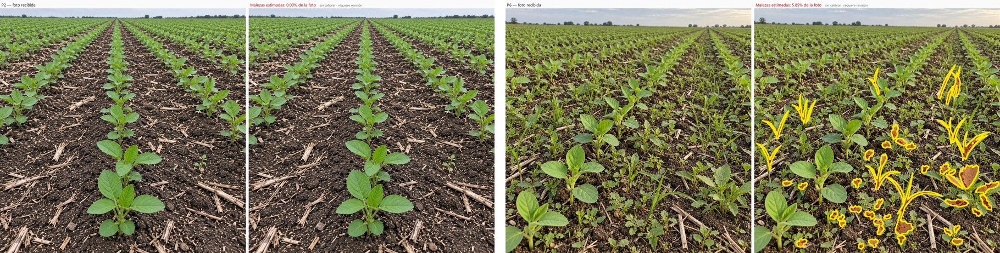

# Malezas en 2 imagenes generadas — Codex gpt-6-astra

Fecha UTC: 2026-09-12T14:29:06.849121+00:00  
Ejecuciones completadas: 2/2  

| Punto | Imagen | Estado | Malezas | Confianza | Tiempo |
| --- | --- | --- | ---: | ---: | ---: |
| P2 | `soja-brotes-jovenes-01.jpg` | `assessed` | 0.00% | 0.00 (sin_calibrar) | 17.0s |
| P6 | `soja-brotes-maleza-media-alta-02.jpg` | `assessed` | 5.85% | 0.17 (baja) | 151.6s |

El porcentaje sale de la misma mascara que aparece pintada en cada vista.
La confianza reutiliza la calibracion exploratoria de Gemini y no esta calibrada para Codex.
Las fotos son sinteticas; los resultados no constituyen validacion agronomica.

