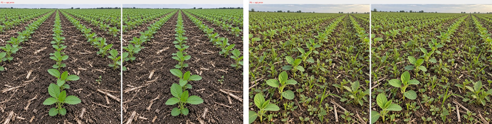

# Malezas en 2 imagenes generadas — gemini-3.1-pro-preview

Fecha UTC: 2026-09-12T13:52:02.845417+00:00
Solicitudes: 2/2 · reintentos automaticos: 0
Equivalente a tarifa paga según `usageMetadata`: USD 0.000000

| Punto | Imagen | Estado | Malezas | Confianza | Tiempo |
| --- | --- | --- | ---: | ---: | ---: |
| P2 | `soja-brotes-jovenes-01.jpg` | `HTTP 429 RESOURCE_EXHAUSTED` | — | — | 1.6s |
| P6 | `soja-brotes-maleza-media-alta-02.jpg` | `HTTP 429 RESOURCE_EXHAUSTED` | — | — | 3.1s |

Google informó cuota gratuita cero para `gemini-3.1-pro`. La clave usada no tuvo acceso al nivel pago durante estas solicitudes. No hubo candidatos ni `usageMetadata`; por eso no existen máscaras, porcentajes o tokens facturables registrados. Activar `--billing-acknowledged` sólo deja constancia de la autorización local: no habilita facturación en Google.

