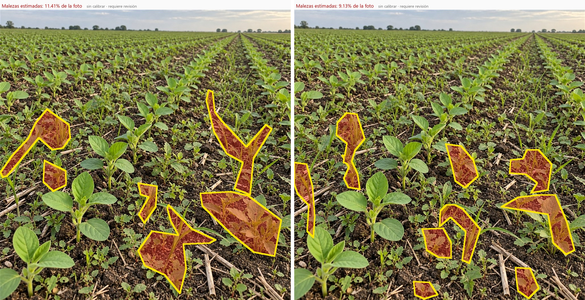
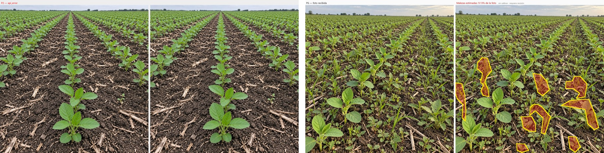

# Malezas en 2 imagenes generadas — gemini-3.8-flash

Fecha UTC: 2026-09-12T13:59:02.467963+00:00
Solicitudes: 2/2 · reintentos automaticos: 0
Equivalente a tarifa paga según `usageMetadata`: USD 0.005916. La API no confirma un cargo y la clave venía operando en free tier.

| Punto | Imagen | Estado | Malezas | Confianza | Tiempo |
| --- | --- | --- | ---: | ---: | ---: |
| P2 | `soja-brotes-jovenes-01.jpg` | `HTTP 503 UNAVAILABLE` | — | — | 4.8s |
| P6 | `soja-brotes-maleza-media-alta-02.jpg` | `assessed` | 9.13% | 0.33 (baja) | 9.7s |

Los rotulos poca/media/alta describen la intencion de generacion; no son verdad agronomica.
El porcentaje sale de la misma mascara que aparece pintada en cada vista de revision.

P6 obtuvo 9,13 %, frente a 11,41 % en la corrida anterior con `gemini-3.6-flash` (−2,28 puntos porcentuales). Ambos overlays omiten malezas pequeñas visibles; sin máscara humana no se puede determinar cuál contorno es más preciso. P2 no produjo una comparación porque 3.8 respondió por alta demanda.

