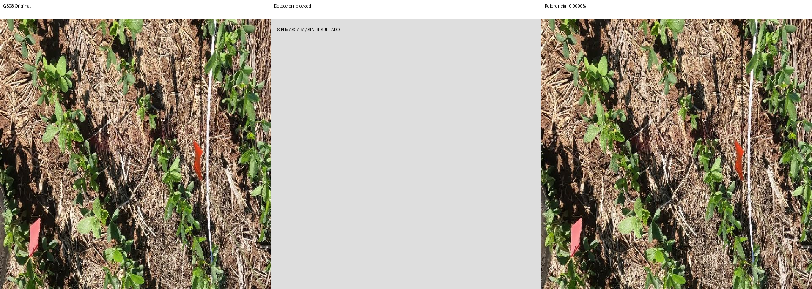
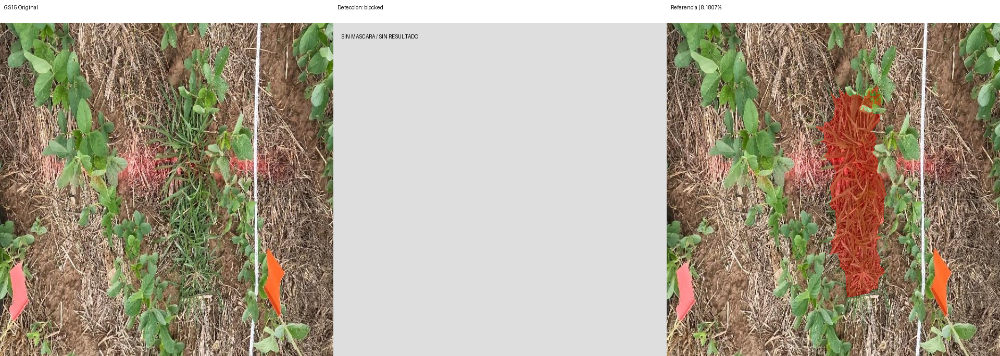

# Segmentación v1 — primera prueba

Modelo: `gemini-3.8-flash`. Fecha UTC: 2026-09-12T02:17:30.916429+00:00.
Solicitudes realizadas: 0/4. Bloqueo: missing_GEMINI_API_KEY.

| Foto | Estado | Referencia % | Contornos % | Error pp | IoU | Ambas vacías |
| --- | --- | ---: | ---: | ---: | ---: | --- |
| GS08 | blocked | 0.0000 | — | — | — | False |
| GS11 | blocked | 0.2815 | — | — | — | False |
| GS15 | blocked | 8.1807 | — | — | — | False |
| control | blocked | — | — | — | — | False |

MAE: — pp (0/3 fotos).
IoU media: — (0 pares con unión no vacía).
El control no integra MAE ni IoU. Ambas máscaras vacías se cuentan aparte.

## Comparaciones

Rojo: píxeles de la máscara binaria usada en el cálculo. Sin resultado se muestra gris.

## Observaciones

Revisión visual de detección pendiente; no se infieren aciertos por pruebas sintéticas.
No ampliar a las nueve de desarrollo ni a las seis finales sin revisar esta corrida.
