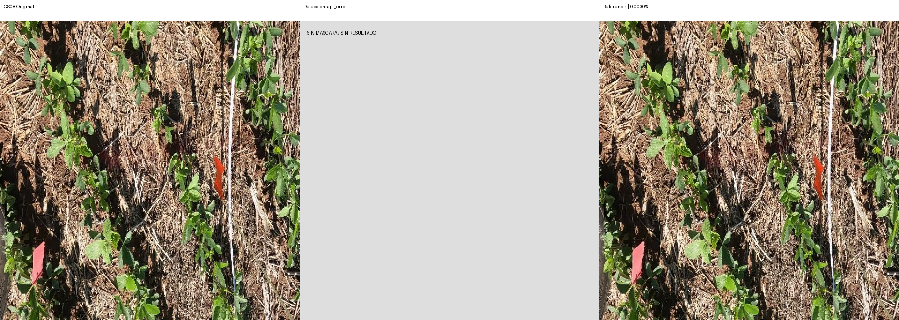
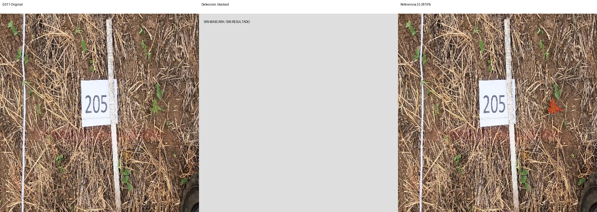
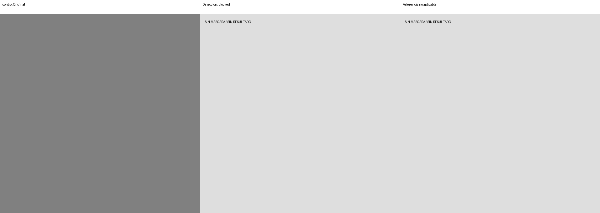

# Segmentación v1 — primera prueba

Modelo: `gemini-3.8-flash`. Fecha UTC: 2026-09-12T02:46:46.050376+00:00.
Solicitudes realizadas: 1/4. Bloqueo: HTTP_400.

| Foto | Estado | Referencia % | Contornos % | Error pp | IoU | Ambas vacías |
| --- | --- | ---: | ---: | ---: | ---: | --- |
| GS08 | api_error | 0.0000 | — | — | — | False |
| GS11 | blocked | 0.2815 | — | — | — | False |
| GS15 | blocked | 8.1807 | — | — | — | False |
| control | blocked | — | — | — | — | False |

MAE: — pp (0/3 fotos).
IoU media: — (0 pares con unión no vacía).
El control no integra MAE ni IoU. Ambas máscaras vacías se cuentan aparte.

## Comparaciones

Rojo: píxeles de la máscara binaria usada en el cálculo. Sin resultado se muestra gris.

## Observaciones

La primera solicitud real, GS08, recibió HTTP 400 en 8,18 segundos. Google devolvió `INVALID_ARGUMENT`: `Request contains an invalid argument.` La respuesta no identifica el argumento rechazado; no permite atribuir la causa a clave, modelo, configuración o esquema.

La respuesta HTTP original se conserva en `GS08.response.bin`. GS11, GS15 y el control no se enviaron. No hubo reintentos ni cambio de modelo/proveedor. Se mantiene la reserva del experimento en `../segmentation-v1.started.json`.

No hay detecciones, máscaras predichas ni ejemplos de aciertos/errores del modelo. MAE e IoU quedan nulos. El panel central gris representa ausencia de resultado, no cero malezas. Revisar el rechazo y acordar una prueba corregida antes de realizar nuevas solicitudes.

No ampliar a las nueve de desarrollo ni a las seis finales sin revisar esta corrida.
