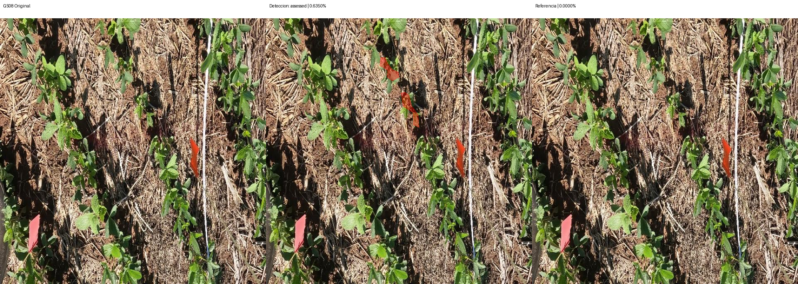
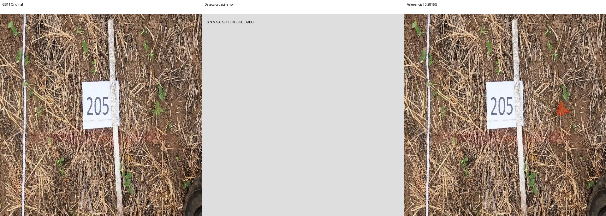

# Segmentación — segmentation-v1-request-v2

Modelo: `gemini-3.8-flash`. Fecha UTC: 2026-09-12T02:53:23.507337+00:00.
Solicitudes realizadas: 2/4. Bloqueo: HTTP_503.

| Foto | Estado | Referencia % | Contornos % | Error pp | IoU | Ambas vacías |
| --- | --- | ---: | ---: | ---: | ---: | --- |
| GS08 | assessed | 0.0000 | 0.6350 | 0.6350 | 0.0000 | False |
| GS11 | api_error | 0.2815 | — | — | — | False |
| GS15 | blocked | 8.1807 | — | — | — | False |
| control | blocked | — | — | — | — | False |

MAE: 0.6350 pp (1/3 fotos).
IoU media: 0.0000 (1 pares con unión no vacía).
El control no integra MAE ni IoU. Ambas máscaras vacías se cuentan aparte.

## Comparaciones

Rojo: píxeles de la máscara binaria usada en el cálculo. Sin resultado se muestra gris.

## Observaciones

Reintento solicitado expresamente por el usuario después del HTTP 400. Antes de enviar fotos, `GET /v1beta/models/gemini-3.8-flash` respondió 200 y confirmó soporte de `generateContent`; evidencia en `../model-access-check.json`. Esa consulta no genera contenido.

Se conservaron modelo, endpoint, imagen, prompt, razonamiento LOW y máximo de 8.192 tokens. Se retiraron del esquema enviado los límites externos de cantidad de contornos, vértices y limitaciones. El contrato local conserva todos los límites, además de geometría y rangos. La documentación advierte sobre rechazo de esquemas complejos: https://ai.google.dev/gemini-api/docs/structured-output#limitations. El esquema reducido fue aceptado; esto respalda la hipótesis de complejidad, aunque el error anterior no identificó el campo exacto.

**GS08:** HTTP 200, respuesta `assessed`, dos contornos y 2.601 píxeles marcados de 409.600: **0,635009765625%**. Referencia vacía (0%): error absoluto **0,635009765625 pp** e **IoU 0**. Son dos regiones de falso positivo respecto de las anotaciones de esta foto. En la comparación se observan sobre vegetación central e incluyen partes del fondo/rastrojo; los bordes no siguen exclusivamente la superficie de hojas. No constituye revisión agronómica.

Se verificó visualmente el PNG y, píxel a píxel, que la máscara guardada coincide con la rasterización de la respuesta y con los 2.601 píxeles modificados por el repintado. El cálculo representa fielmente los contornos devueltos; no valida su clasificación. No hay ejemplo de detección correcta de malezas en esta corrida.

**GS11:** HTTP 503 / `UNAVAILABLE`. Google indicó alta demanda temporal del modelo. Es un fallo de servicio, no de detección. No se reintentó; GS15 y el control no se enviaron. Sus porcentajes e IoU son nulos. El MAE mostrado corresponde a una sola foto y no permite valorar la calidad global.

La nueva reserva es `../segmentation-v1-request-v2.started.json`; se conserva la reserva de la primera prueba. En total histórico: tres solicitudes de generación (una en la corrida anterior y dos en esta), más una consulta de metadatos. No se amplió la selección ni se usaron fotos finales.

No ampliar a las nueve de desarrollo ni a las seis finales sin revisar esta corrida.
