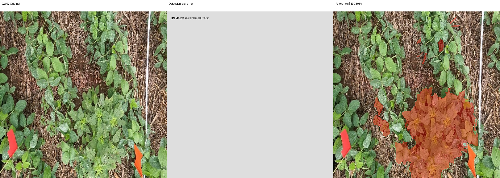
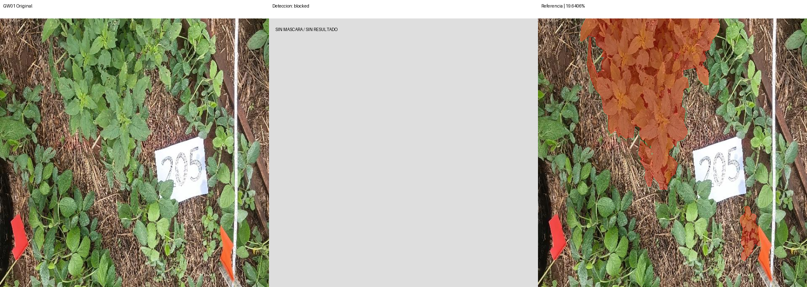
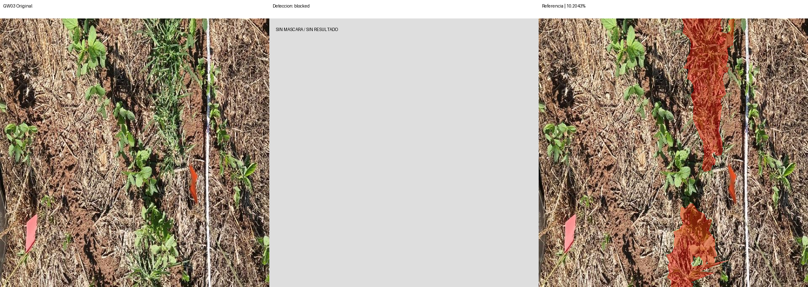

# Segmentación — segmentation-v2-weeds

Modelo: `gemini-3.8-flash`. Fecha UTC: 2026-09-12T04:46:23.869091+00:00.
Solicitudes realizadas: 1/4. Bloqueo: HTTP_503.

| Foto | Estado | Referencia % | Contornos % | Error pp | IoU | Ambas vacías |
| --- | --- | ---: | ---: | ---: | ---: | --- |
| GW02 | api_error | 19.3506 | — | — | — | False |
| GW01 | blocked | 19.6406 | — | — | — | False |
| GW03 | blocked | 10.2043 | — | — | — | False |
| control | blocked | — | — | — | — | False |

MAE: — pp (0/3 fotos).
IoU media: — (0 pares con unión no vacía).
El control no integra MAE ni IoU. Ambas máscaras vacías se cuentan aparte.

## Comparaciones

Rojo: píxeles de la máscara binaria usada en el cálculo. Sin resultado se muestra gris.

## Observaciones

Revisión visual de detección pendiente; no se infieren aciertos por pruebas sintéticas.
No ampliar al resto del conjunto de desarrollo ni abrir el final sin revisar esta corrida.
