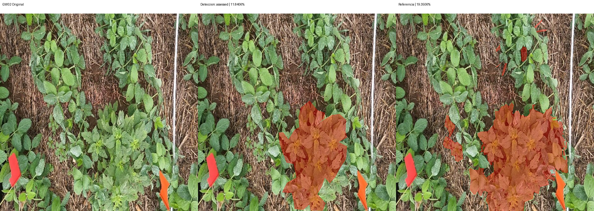
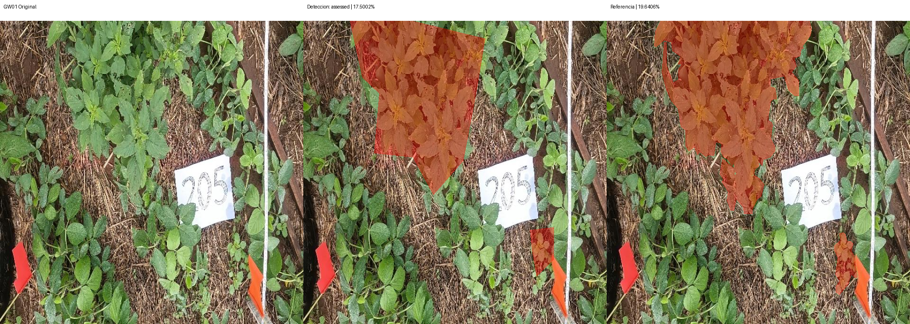
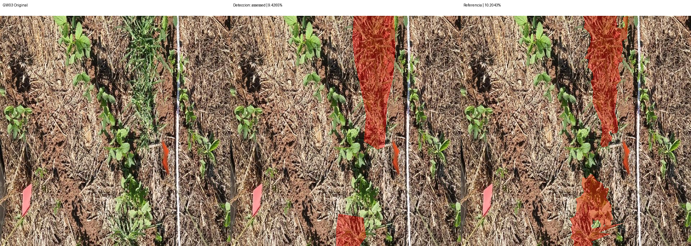
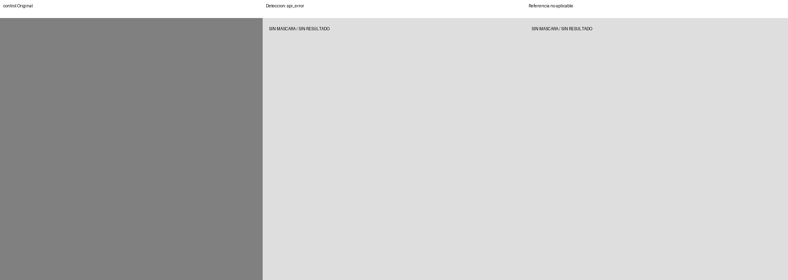

# Segmentación — v2-weeds-36

Modelo: `gemini-3.6-flash`. Fecha UTC: 2026-09-12T05:01:54.101573+00:00.
Solicitudes realizadas: 4/4. Bloqueo: HTTP_503.

| Foto | Estado | Referencia % | Contornos % | Error pp | IoU | Ambas vacías |
| --- | --- | ---: | ---: | ---: | ---: | --- |
| GW02 | assessed | 19.3506 | 11.8406 | 7.5100 | 0.5762 | False |
| GW01 | assessed | 19.6406 | 17.5002 | 2.1404 | 0.7445 | False |
| GW03 | assessed | 10.2043 | 9.4265 | 0.7778 | 0.6151 | False |
| control | api_error | — | — | — | — | False |

MAE: 3.4761 pp (3/3 fotos).
IoU media: 0.6453 (3 pares con unión no vacía).
El control no integra MAE ni IoU. Ambas máscaras vacías se cuentan aparte.

## Comparaciones

Rojo: píxeles de la máscara binaria usada en el cálculo. Sin resultado se muestra gris.

## Observaciones

Revisión visual de detección pendiente; no se infieren aciertos por pruebas sintéticas.
No ampliar al resto del conjunto de desarrollo ni abrir el final sin revisar esta corrida.
