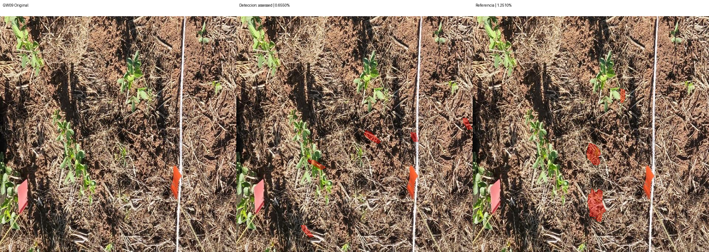
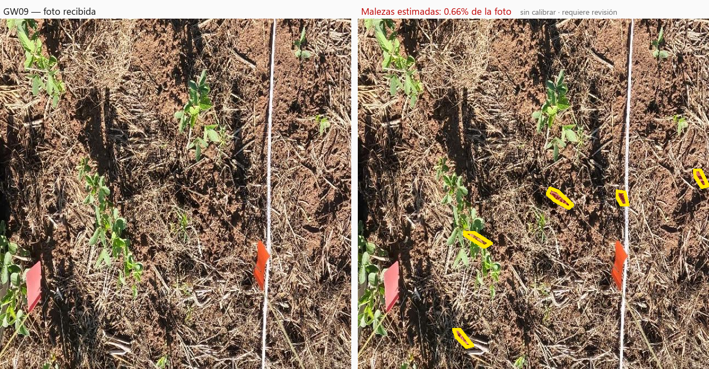

# Segmentación — v2-weeds-36-gw09

Modelo: `gemini-3.6-flash`. Fecha UTC: 2026-09-12T05:27:10.803640+00:00.
Solicitudes realizadas: 2/2. Bloqueo: ninguno.

| Foto | Estado | Referencia % | Contornos % | Error pp | IoU | Ambas vacías |
| --- | --- | ---: | ---: | ---: | ---: | --- |
| GW09 | assessed | 1.2510 | 0.6550 | 0.5959 | 0.0000 | False |
| control | not_assessable | — | — | — | — | False |

MAE: 0.5959 pp (1/1 fotos).
IoU media: 0.0000 (1 pares con unión no vacía).
El control no integra MAE ni IoU. Ambas máscaras vacías se cuentan aparte.

## Comparaciones

Rojo: píxeles de la máscara binaria usada en el cálculo. Sin resultado se muestra gris.

## Observaciones

Revisión visual de detección pendiente; no se infieren aciertos por pruebas sintéticas.
No ampliar al resto del conjunto de desarrollo ni abrir el final sin revisar esta corrida.
