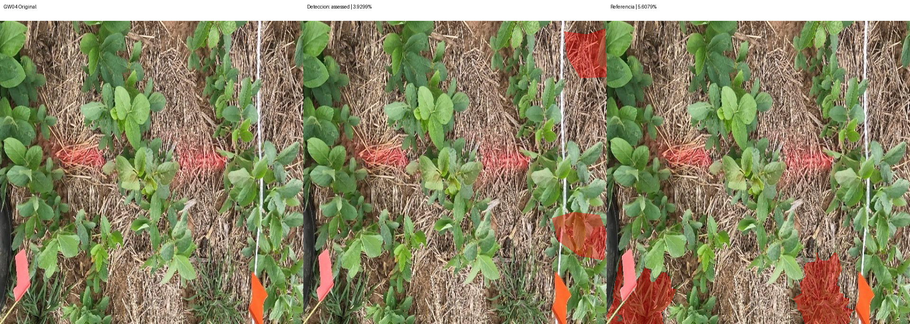
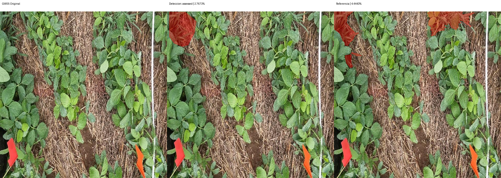
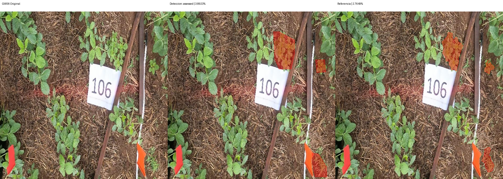

# Segmentación — v2-weeds-36-resto

Modelo: `gemini-3.6-flash`. Fecha UTC: 2026-09-12T05:06:23.202066+00:00.
Solicitudes realizadas: 4/7. Bloqueo: HTTP_503.

| Foto | Estado | Referencia % | Contornos % | Error pp | IoU | Ambas vacías |
| --- | --- | ---: | ---: | ---: | ---: | --- |
| GW04 | assessed | 5.6079 | 3.9299 | 1.6780 | 0.0000 | False |
| GW05 | assessed | 4.4443 | 2.7673 | 1.6770 | 0.2716 | False |
| GW06 | assessed | 2.7649 | 3.8923 | 1.1274 | 0.6005 | False |
| GW07 | api_error | 1.8057 | — | — | — | False |
| GW08 | blocked | 1.7002 | — | — | — | False |
| GW09 | blocked | 1.2510 | — | — | — | False |
| control | blocked | — | — | — | — | False |

MAE: 1.4941 pp (3/6 fotos).
IoU media: 0.2907 (3 pares con unión no vacía).
El control no integra MAE ni IoU. Ambas máscaras vacías se cuentan aparte.

## Comparaciones

Rojo: píxeles de la máscara binaria usada en el cálculo. Sin resultado se muestra gris.

## Observaciones

Revisión visual de detección pendiente; no se infieren aciertos por pruebas sintéticas.
No ampliar al resto del conjunto de desarrollo ni abrir el final sin revisar esta corrida.
