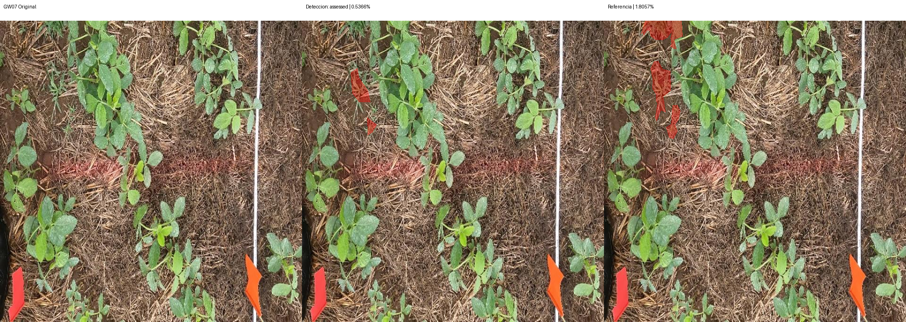
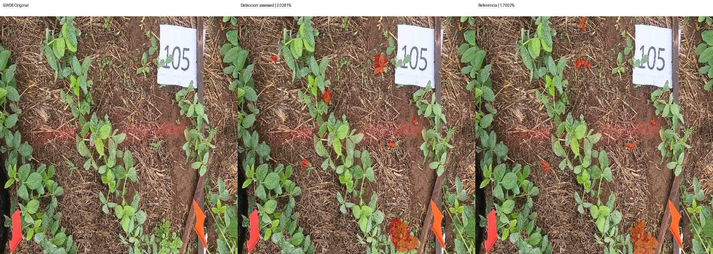
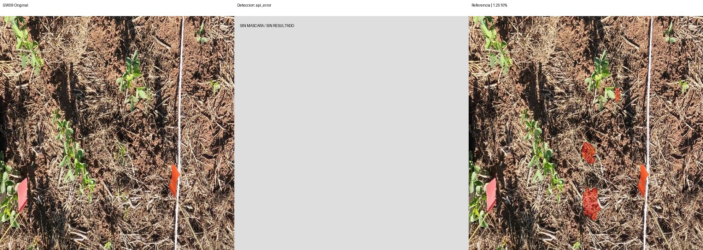

# Segmentación — v2-weeds-36-resto3

Modelo: `gemini-3.6-flash`. Fecha UTC: 2026-09-12T05:08:25.394200+00:00.
Solicitudes realizadas: 3/4. Bloqueo: transport_error_or_timeout.

| Foto | Estado | Referencia % | Contornos % | Error pp | IoU | Ambas vacías |
| --- | --- | ---: | ---: | ---: | ---: | --- |
| GW07 | assessed | 1.8057 | 0.5366 | 1.2690 | 0.2280 | False |
| GW08 | assessed | 1.7002 | 2.0281 | 0.3279 | 0.3766 | False |
| GW09 | api_error | 1.2510 | — | — | — | False |
| control | blocked | — | — | — | — | False |

MAE: 0.7985 pp (2/3 fotos).
IoU media: 0.3023 (2 pares con unión no vacía).
El control no integra MAE ni IoU. Ambas máscaras vacías se cuentan aparte.

## Comparaciones

Rojo: píxeles de la máscara binaria usada en el cálculo. Sin resultado se muestra gris.

## Observaciones

Revisión visual de detección pendiente; no se infieren aciertos por pruebas sintéticas.
No ampliar al resto del conjunto de desarrollo ni abrir el final sin revisar esta corrida.
