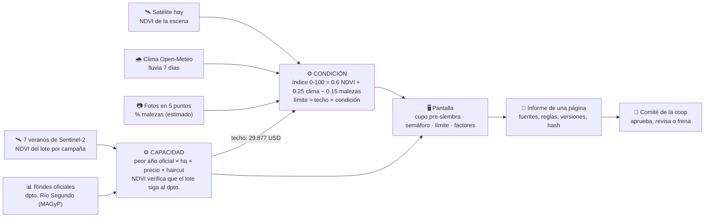

# Cómo funciona PreCrop

Un solo lote de soja, real, de 100 ha en Río Segundo, Córdoba. Dos preguntas que hoy la coop contesta a ojo:

- **¿Cuánto?** Capacidad: contra el peor año que el departamento ya tuvo, verificado con siete veranos de satélite. Se decide antes de sembrar.
- **¿Sigo?** Condición: un semáforo en campaña que libera o frena el próximo desembolso.

## Los números de la demo

| Momento | Dato | Resultado |
|---|---|---|
| Antes de sembrar | Peor año oficial del dpto.: 2022/23, 1,17 t/ha. El lote sigue al dpto. (ratio 1,04) | **Cupo pre-siembra 29.877 USD** |
| 2 de febrero | NDVI 0.782 · lluvia 46.7 mm · malezas 12 % | Condición 74 → **verde**, límite 22.235 USD, primer desembolso |
| 7 de febrero | NDVI 0.763 · lluvia 0.1 mm · malezas 65 % | Condición 48 → **rojo**, límite 0, segundo desembolso frenado |
| Cosecha | Entrega en el acopio | El anticipo se descuenta en la liquidación |

Lo honesto, y se dice: entre el 2 y el 7 de febrero el satélite casi no cambia (la planta no se seca en cinco días). Lo que tira el lote a rojo es la seca real de 14 días más las malezas, que hoy son estimadas sobre fotos. El satélite solo lo deja en amarillo; las fotos lo llevan a rojo.

## Qué es cada cosa, en una línea

| Pieza | Qué hace | Base |
|---|---|---|
| Historial | Siete veranos del mismo cuadrado de campo, NDVI por escena, pico y mínimo por campaña | Sentinel-2 L2A, Planetary Computer, medido |
| Rindes oficiales | Rinde de soja del departamento por campaña | MAGyP, serie pública, medido |
| Capacidad | Cupo contra el peor año oficial; el NDVI solo verifica representatividad | regla `capacidad-v2` |
| Condición | Índice 0–100 con tres factores a la vista; semáforo 70 / 50 | regla publicada en el pack |
| Límite en campaña | Techo de capacidad × condición; rojo bloquea | regla `cupo-v2` |
| Informe | Una página: cupo, condición, factores, fuentes, versiones, hash, cuadro de firmas | `GET /report/<escenario>` |
| Visión | Estima malezas sobre fotos; hoy experimental, la demo usa valores del pack | IA, se dice en voz alta |

## Vocabulario que no se negocia

- **Índice de condición del cultivo** y **límite de anticipo sugerido**. Nunca "score crediticio" ni "riesgo".
- **Capacidad define cuánto; condición define si seguís.**
- **IA** solo para la detección de malezas. Todo lo demás son reglas transparentes y versionadas.
- **No prestamos.** Vendemos la decisión ya tomada, en un formato que un comité firma.
