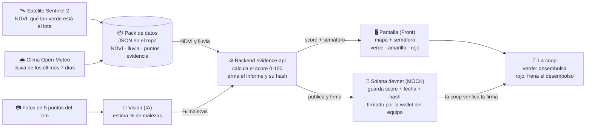
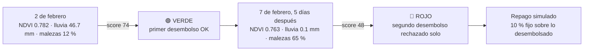

# Cómo funciona PreCrop

Un solo lote de soja en Río Segundo, Córdoba. Tres fuentes de datos, un score, un semáforo, y una firma en la cadena que certifica de dónde salió.

## Qué es cada cosa, en una línea

| Pieza | Qué hace | Quién la hace |
|---|---|---|
| Pack de datos | La verdad del lote: NDVI medido, lluvia medida, puntos, informes con hash. Ya está hecho y no llama a ningún satélite el día de la demo. | Datos (Franco) |
| Visión | Mira las fotos de los 5 puntos y dice cuánta maleza hay. Hoy es estimado, no hay drone. | IA |
| Backend | Junta NDVI + lluvia + malezas, calcula el score con la fórmula del equipo, arma el informe de evidencia y lo hashea. | Datos (Franco) |
| Pantalla | Mapa del lote, toggle de escenarios, fotos, semáforo. Botón "Publicar score". | Front |
| Solana | Es el escribano: deja firmado que ese score existía con esa evidencia en esa fecha. No presta plata, no verifica el campo. | Datos (Franco), Memo program |
| La coop | Ve el semáforo y la firma, y decide si suelta o frena el próximo desembolso. | El cliente |

## La historia de la demo

Lo honesto, y se dice en voz alta: entre el 2 y el 7 de febrero el satélite casi no cambia (la planta no se seca en cinco días). Lo que tira el lote a rojo es la **seca real de 14 días** más las **malezas**, que hoy son simuladas. El satélite solo lo deja en amarillo; las fotos lo llevan a rojo. Ese es el valor de las fotos.
