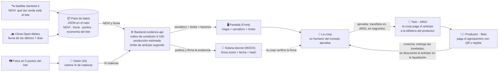
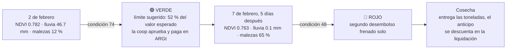

# Cómo funciona PreCrop

Un solo lote de soja en Río Segundo, Córdoba. Tres fuentes de datos, un índice de condición del cultivo, un límite de anticipo sugerido, y una firma en la cadena que certifica de dónde salió. La plata viaja por Twin en ARGt.

## Qué es cada cosa, en una línea

| Pieza | Qué hace | Quién la hace |
|---|---|---|
| Pack de datos | La verdad del lote: NDVI medido, lluvia medida, puntos, economía de referencia, informes con hash. No llama a ningún satélite el día de la demo. | Datos |
| Visión | Mira las fotos de los 5 puntos y dice cuánta maleza hay. Hoy es estimado, no hay drone. Acá está la IA. | IA |
| Backend | Junta NDVI + lluvia + malezas en un índice de condición 0 a 100, estima toneladas y sugiere hasta cuánto anticipar. Reglas visibles y versionadas, no un modelo de crédito. | Datos |
| Pantalla | Mapa del lote, toggle de escenarios, fotos, semáforo, límite sugerido y los factores que lo movieron. | Front |
| Solana | El escribano: deja firmado que ese índice existía con esa evidencia en esa fecha. No presta plata, no verifica el campo. | Datos |
| La coop | Un humano mira el límite y los factores, y aprueba o no. | El cliente |
| Twin | El riel de pago: la coop transfiere el anticipo en ARGt (stablecoin en pesos) a la billetera del productor, cualquier día, en segundos. | Track Twin |
| Productor | Usa la plata con Belo sin entender qué es una blockchain. En la cosecha entrega y se le descuenta. | El socio |

## La historia de la demo

Lo honesto, y se dice en voz alta: entre el 2 y el 7 de febrero el satélite casi no cambia (la planta no se seca en cinco días). Lo que tira el lote a rojo es la **seca real de 14 días** más las **malezas**, que hoy son simuladas. El satélite solo lo deja en amarillo; las fotos lo llevan a rojo. Ese es el valor de las fotos.

## Vocabulario que no se negocia

- **Índice de condición del cultivo**, nunca "score crediticio" ni "riesgo". No hay etiquetas de repago contra las que validar un modelo de crédito, y no hacen falta: el repago está capturado en la liquidación de la entrega.
- **Límite de anticipo sugerido**: el output principal. Hasta X % del valor de la producción estimada. El benchmark es lo que la coop hace hoy: un porcentaje plano para todos.
- **IA** solo para la detección de malezas por visión. El índice es un conjunto de reglas transparente y versionado (`cupo-v1`), interpretable por diseño porque el usuario es un consejo que rinde cuentas a sus socios.
- **Flywheel**: cada anticipo genera un label (se entregó, cuántas toneladas, con qué desvío). Firmado en la cadena, ese dataset no existe hoy en el país. La heurística es el arranque en frío que lo fabrica.
